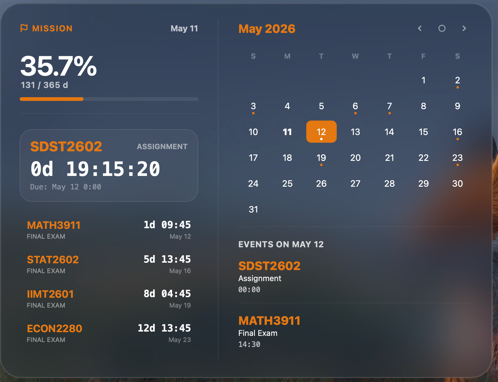

# 🚀 Uni Mission Control

[**English**](#-uni-mission-control-en) | [**中文说明**](#-uni-mission-control-zh)

---

<a name="-uni-mission-control-en"></a>
## 🇬🇧 Uni Mission Control (English)

**An aesthetic, high-performance mission management widget for macOS.**

Built on the [Übersicht](https://tracesof.net/uebersicht/) framework, this widget provides a transparent, "jelly-like" elastic mission monitoring panel. It features automatic Moodle/iCal synchronization and AI-driven field recognition.

### 📸 Preview
 
*(The panel displays countdowns, progress bars, and calendar details)*

### ✨ Key Features
* **Dynamic Layout**: Window height automatically adjusts based on task count with smooth elastic animations.
* **Smart Sync**: Automatically parses iCal subscription URLs from Moodle/Canvas.
* **AI Import**: Built-in AI Prompt helps transform raw text into valid JSON mission formats.
* **Visual Excellence**: Deep frosted glass texture designed to match macOS modern aesthetics.

### 🛠️ Installation (Manual)
1. **Prepare**: Download and install [Übersicht](https://tracesof.net/uebersicht/) (official website).
2. **Open Folder**: Click the `Ü` icon in your Mac's top menu bar and select **"Open Widgets Folder"**.
3. **Drag & Drop**: Drag the downloaded **`Uni_Mission_Control.widget`** folder directly into the folder that just opened.

---

<a name="-uni-mission-control-zh"></a>
## 🇨🇳 Uni Mission Control (中文说明)

**一款为 macOS 打造的极致美学任务管理插件。**

基于 [Übersicht](https://tracesof.net/uebersicht/) 框架开发，提供具有“果冻感”弹性动画的任务监控面板。支持 Moodle/iCal 自动同步及 AI 智能字段识别。

### 📸 预览
 
*(面板展示了任务倒计时、年度进度条以及详细的日历日程)*

### ✨ 核心特性
* **动态布局**：窗口高度随任务数量自动伸缩，并带有丝滑的弹性过渡动画。
* **多维同步**：自动解析 iCal 订阅链接（如 Moodle/Canvas）。
* **AI 导入**：内置 AI Prompt 引导，支持将繁杂的文本一键转化为标准的 JSON 任务字段。
* **极致视觉**：完美契合 macOS 系统的深色毛玻璃质感设计。

### 🛠️ 安装指南 (手动安装)
1. **下载软件**：前往 [官网](https://tracesof.net/uebersicht/) 下载并打开 **Übersicht**。
2. **打开目录**：点击 Mac 屏幕顶部菜单栏的 `Ü` 图标，选择 **"Open Widgets Folder"**。
3. **完成安装**：将下载解压好的 **`Uni_Mission_Control.widget`** 文件夹整体拖入打开的文件夹中即可。

---

### 📂 仓库结构 / Repository Structure

```text
.
├── Uni_Mission_Control.widget/   # 核心代码文件夹 / Core widget folder
├── README.md                     # 说明文档 / Documentation
└── preview.png                   # 预览截图 / Preview screenshot
