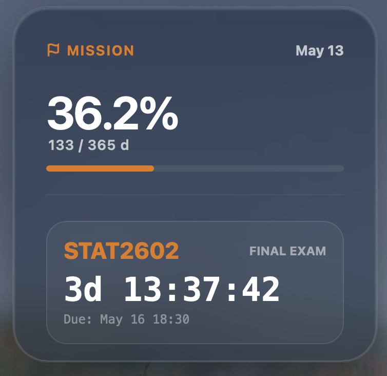
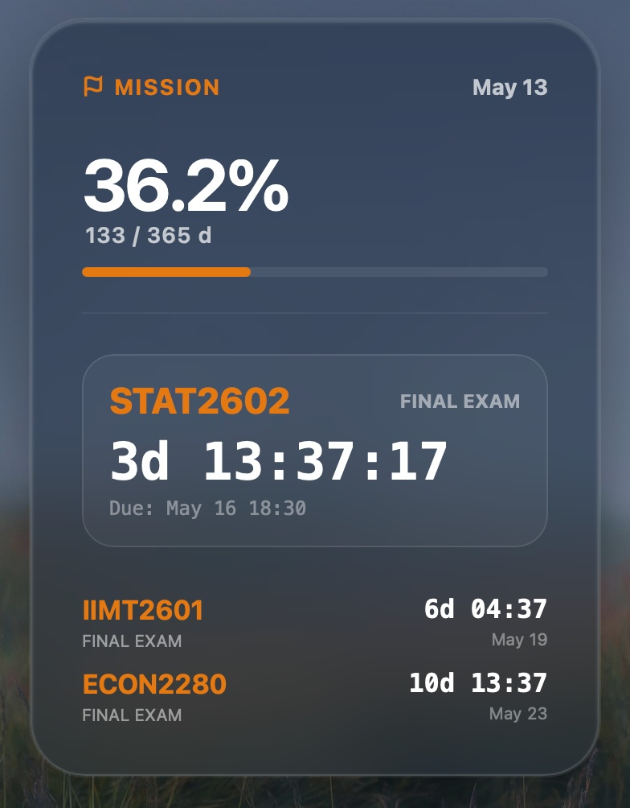
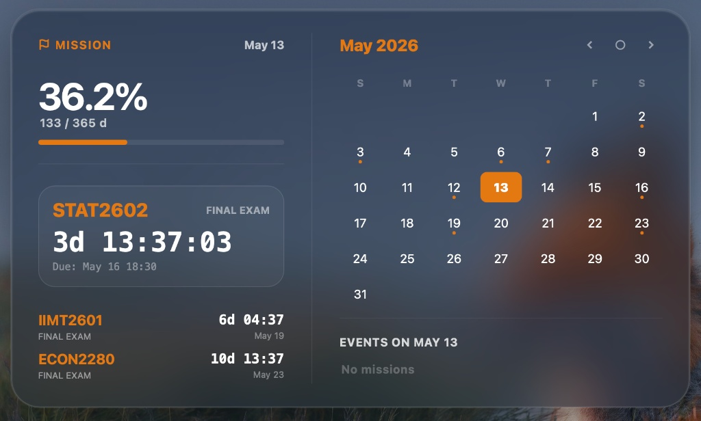
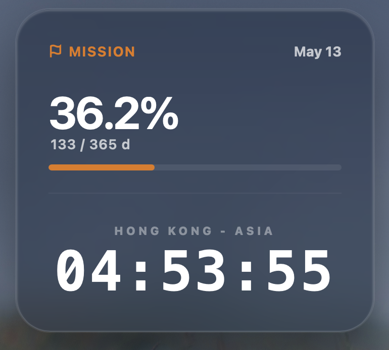
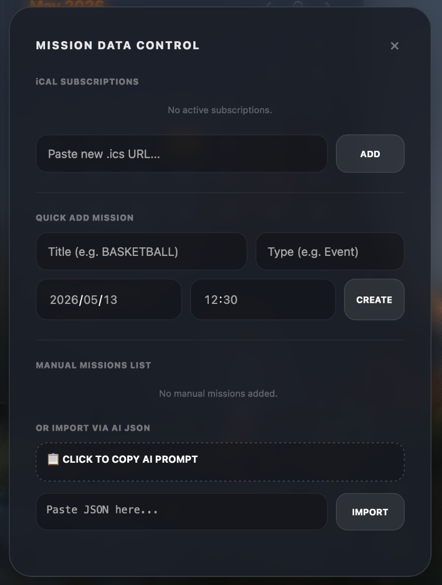
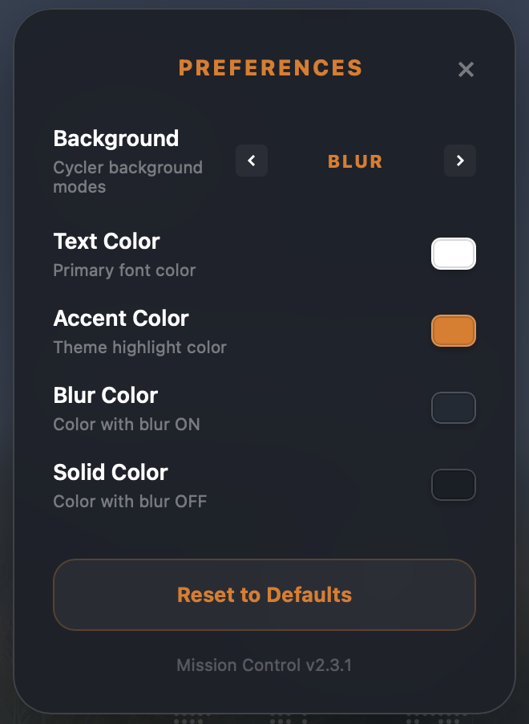

# Uni Mission Control

Uni Mission Control is a sophisticated desktop widget for macOS, built on **Üebersicht**. It features a refined Glassmorphism UI, seamlessly integrating academic mission tracking, Moodle calendar synchronization, a world clock, and an interactive dot-matrix map to help students manage their academic life effectively.

## 📸 Preview

| Level 1: Compact | Level 2: List | Level 3: Full Calendar |
| :---: | :---: | :---: |
|  |  |  |

| World Map Mode | Digital Clock Mode |
| :---: | :---: |
|  |  |

| Data Control Center | Preferences |
| :---: | :---: |
|  |  |

## ✨ Key Features

* **Dynamic Mission Tracking**: Supports three display levels. Level 1 shows a compact countdown, Level 2 expands to a mission list, and Level 3 provides a comprehensive calendar and mission details.
* **Automated Sync**: Automatically parses assignments, quizzes, and exams from Moodle or other iCal links.
* **Performance Optimized Dot-Matrix Map**: Features an interactive world map composed of 1,925 nodes with a smooth CSS-based delayed fade-in animation to ensure zero frame-drops during transitions.
* **Glassmorphism UI**: Beautifully designed with blur, transparency, and solid background modes, customizable via the Preferences panel.
* **Integrated Data Management**: Quickly add missions manually or import them using AI-generated JSON data.
* **Customizable Aesthetics**: Adjust text colors, accent colors, and background blur settings in real-time.

## 🛠️ Installation

1.  **Install Üebersicht**: Download it from [tracesof.net/uebersicht/](https://tracesof.net/uebersicht/).
2.  **Download the Widget**: Place the `Uni_Mission_Control.widget` folder into your Üebersicht widgets directory (usually `~/Library/Application Support/Uebersicht/widgets`).
3.  **Configure API**: Open `api.jsx` and enter your iCal subscription link in the `MOODLE_URL` variable.
4.  **Refresh**: Select 'Refresh All Widgets' from the Üebersicht menu.

## 🖱️ Interaction & Shortcuts

* **Cycle Levels**: Click the arc handle in the bottom-right to toggle between View Levels 1, 2, and 3.
* **Drag & Drop**: Use the hidden trigger area in the top-left to reposition the widget on your desktop.
* **Toggle Map/Mission**: Clicking the primary mission card toggles between the World Clock/Map mode and the Mission card mode.
* **Open Settings**: Click the ellipsis icon next to the date in the header.

## 📄 License

This project is licensed under the MIT License.

---

# Uni Mission Control (中文版)

**Uni Mission Control** 是一款专为 macOS 打造的 **Üebersicht** 桌面组件。它采用精致的毛玻璃（Glassmorphism）设计语言，将学业任务管理、Moodle 日历同步、世界时钟与点阵地图完美结合，旨在为学生提供一个优雅且高效的桌面信息中心。

## 📸 效果预览

| 等级 1：核心倒计时 | 等级 2：任务列表 | 等级 3：完整日历 |
| :---: | :---: | :---: |
|  |  |  |

| 世界点阵地图 | 数字时钟模式 |
| :---: | :---: |
|  |  |

| 数据管理中心 | 偏好设置 |
| :---: | :---: |
|  |  |

## ✨ 核心特性

* **多维任务管理**：支持三种展示等级。Level 1 为精简倒计时，Level 2 展开任务列表，Level 3 提供完整的日历与任务详情视图。
* **自动化同步**：通过 iCal 链接自动解析 Moodle 平台上的作业、测验与考试信息。
* **性能优化点阵图**：内置由 1,925 个独立节点构成的世界地图，采用 CSS 硬件加速与延迟渐显动画，确保在窗口缩放时依然丝滑顺畅。
* **毛玻璃视觉设计**：提供 Blur（模糊）、Transparent（半透明）、Solid（纯色）及 None 四种背景模式，均可通过设置面板实时切换。
* **一体化数据控制**：支持手动创建任务，或通过 AI 生成的 JSON 数据包快速导入。
* **高度自定义色彩**：支持自定义文字颜色与强调色，并针对深浅色彩块进行了视觉描边优化，防止视觉膨胀或缺失。

## 🛠️ 安装指南

1.  **安装 Üebersicht**：访问 [tracesof.net/uebersicht/](https://tracesof.net/uebersicht/) 下载并安装。
2.  **部署组件**：将 `Uni_Mission_Control.widget` 文件夹放入你的 Üebersicht 插件目录（通常为 `~/Library/Application Support/Uebersicht/widgets`）。
3.  **配置 API**：打开 `api.jsx` 文件，在 `MOODLE_URL` 变量中填入你的 iCal 订阅链接。
4.  **刷新**：在 Üebersicht 菜单中选择 “Refresh All Widgets”。

## 🖱️ 交互与快捷操作

* **切换等级**：点击组件右下角的弧形手柄，可在等级 1、2、3 之间循环切换。
* **自由拖拽**：按住左上角的隐藏手柄区域即可在桌面上移动组件。
* **地图/任务切换**：点击主任务卡片可立即切换至世界时钟模式；点击时钟区域可切回任务卡片。
* **偏好设置**：点击页眉日期旁边的省略号图标即可打开 Preferences 界面。

## 📄 开源协议

本项目基于 MIT 协议开源。
